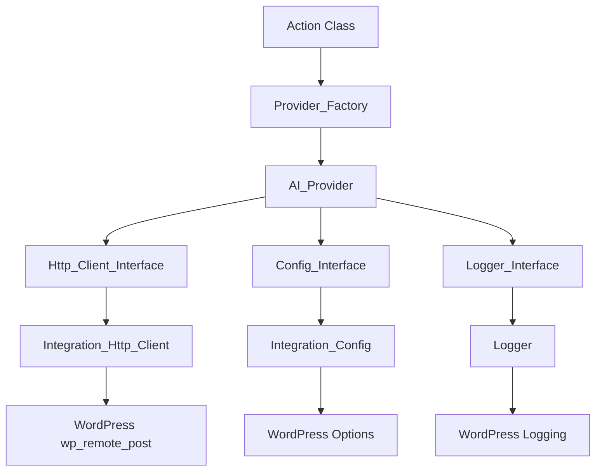

# Uncanny Automator AI Framework Documentation

## Overview

The Uncanny Automator AI Framework provides a unified interface for integrating multiple AI providers into WordPress automation workflows. It uses clean architecture principles to keep the codebase maintainable and testable.

### Industry Practices in WordPress

This framework applies software engineering practices where they solve real problems:

**What We Actually Do**:
- **Factory Pattern** for provider creation (eliminates manual dependency wiring)
- **Strategy Pattern** for AI providers (swap OpenAI for Claude without code changes)  
- **Adapter Pattern** for WordPress integration (keeps AI logic separate from WordPress specifics)
- **Builder Pattern** for request construction (fluent API instead of giant arrays)
- **Dependency Inversion** via interfaces (enables testing with mocks)

**What We Don't Over-Engineer**:
- No deep inheritance chains (max 2-3 levels with clear purpose)
- No generic "everything" abstractions  
- No premature optimization
- Direct use of WordPress APIs where appropriate

**WordPress Integration Approach**:
- Uses WordPress options API for configuration storage
- Leverages WordPress HTTP API (`wp_remote_post`) for external requests
- Integrates with WordPress security (nonces, sanitization, capabilities)
- Works within WordPress action/filter system for extensibility

## Framework Structure

```
src/core/lib/ai/
├── core/
│   ├── interfaces/               # Contracts for framework components
│   ├── traits/                   # Reusable functionality
│   └── abstracts/                # Base abstract classes
├── factory/
│   └── provider-factory.php      # Provider creation and registration
├── http/
│   ├── payload.php               # Request builder
│   ├── request.php               # Request object
│   └── response.php              # Response object
├── provider/                     # AI provider implementations
├── adapters/                     # WordPress integration layer
├── exceptions/                   # Error handling
└── load.php                      # Bootstrap file
```

## Architecture Overview

When an action needs to call an AI provider, here's what happens:

1. **Action Class** asks the **Provider_Factory** for a specific provider (like 'OPENAI')
2. **Provider_Factory** creates an **AI_Provider** instance with all dependencies injected
3. **AI_Provider** uses three interfaces to do its work:
   - **Http_Client_Interface** → **Integration_Http_Client** → **WordPress wp_remote_post** (for API calls)
   - **Config_Interface** → **Integration_Config** → **WordPress Options** (for API keys)
   - **Logger_Interface** → **Logger** → **WordPress Logging** (for debugging)

The interfaces act as contracts - providers don't know they're talking to WordPress, they just use the interfaces. The adapter classes handle the WordPress-specific implementation.



### Why This Architecture

- **Dependency flows inwards, not outwards, no circular dependencies**
- **Interfaces separate AI logic from WordPress implementation details** - providers focus on AI operations, adapters handle WordPress specifics
- **Easy to unit test** - mock the interfaces, test the business logic
- **Provider implementations are interchangeable** - same interface, different AI services
- **Clear boundaries** - WordPress changes only affect adapter classes
- **Factory eliminates manual dependency injection** - no need to wire up HTTP client, config, logger manually
- **Data objects can't be accidentally modified** - Request, Response, Headers, Body are read-only after creation
- **Single responsibility** - each class has one clear job
- **Standardized response format** - all providers return the same Response object structure
- **Configuration centralized** - all API keys stored in WordPress options with consistent naming
- **Settings page abstraction** - integrations define settings in an array, no need for custom classes, views, or helper files

## Working with the Framework

### For Action Developers

```php
class Your_AI_Action extends Action {
    use Base_AI_Provider_Trait;
    use Base_Payload_Message_Array_Builder_Trait;
    
    protected function process_action($user_id, $action_data, $recipe_id, $args, $parsed) {
        $provider = $this->get_provider('OPENAI');
        
        $payload = $provider->create_builder()
            ->endpoint('https://api.openai.com/v1/chat/completions')
            ->model($model)
            ->temperature($temperature)
            ->messages($this->create_simple_message($system, $prompt))
            ->build();
            
        $response = $provider->send_request($payload);
        $ai_response = $provider->parse_response($response);
        
        $this->hydrate_tokens(['RESPONSE' => $ai_response->get_content()]);
        return true;
    }
}
```

### For Provider Developers

```php
final class Your_Provider implements AI_Provider_Interface {
    use Base_Provider_Trait;
    
    private $http;
    
    public function __construct(Http_Client_Interface $http) {
        $this->http = $http;
    }
    
    public function create_builder(): Payload {
        $this->ensure_initialized();
        $apiKey = $this->config->get('automator_your_provider_api_key');
        
        return (new Payload())
            ->authorization($apiKey)
            ->json_content();
    }
    
    public function send_request(Request $payload): array {
        $url = (string) $payload->get_endpoint();
        $body = $payload->get_body()->to_array();
        $headers = $payload->get_headers()->to_array();
        
        return $this->http->post($url, $body, $headers);
    }
    
    public function parse_response(array $response): Response {
        $content = $response['your_content_field'];
        $metadata = [
            'prompt_tokens' => $response['usage']['input'] ?? 0,
            'completion_tokens' => $response['usage']['output'] ?? 0,
            'model' => $response['model'] ?? '',
        ];
        
        return new Response($content, $metadata, $response);
    }
}
```

## Adding New AI Providers

1. **Create Provider Class**: Implement `AI_Provider_Interface`
2. **Register Provider**: Add to `load.php`
   ```php
   Provider_Factory::register_provider('YOUR_PROVIDER', Your_Provider::class);
   ```
3. **Create Action Class**: Use provided traits
4. **Create Integration Class**: Set up WordPress integration

## Testing

```php
// Mock HTTP client
$mockHttp = $this->createMock(Http_Client_Interface::class);
$mockHttp->expects($this->once())
    ->method('post')
    ->willReturn(['choices' => [['message' => ['content' => 'test response']]]]);

// Test provider
$provider = new OpenAI_Provider($mockHttp);
$provider->set_config($mockConfig);
$provider->set_logger($mockLogger);
```

## WordPress Integration

- **Configuration**: Settings stored in WordPress options (`automator_{provider}_api_key`)
- **HTTP Requests**: Uses WordPress `wp_remote_post()` 
- **Logging**: Uses WordPress/Automator logging system
- **Security**: WordPress nonces, sanitization, escaping

## Error Handling

The framework uses these exceptions:
- `AI_Service_Exception`: HTTP and API errors
- `Validation_Exception`: Input validation failures  
- `Response_Exception`: Response parsing errors
- `Configuration_Exception`: Setup errors

---

## Documentation Attribution

**Generated by:** Claude Sonnet 4 